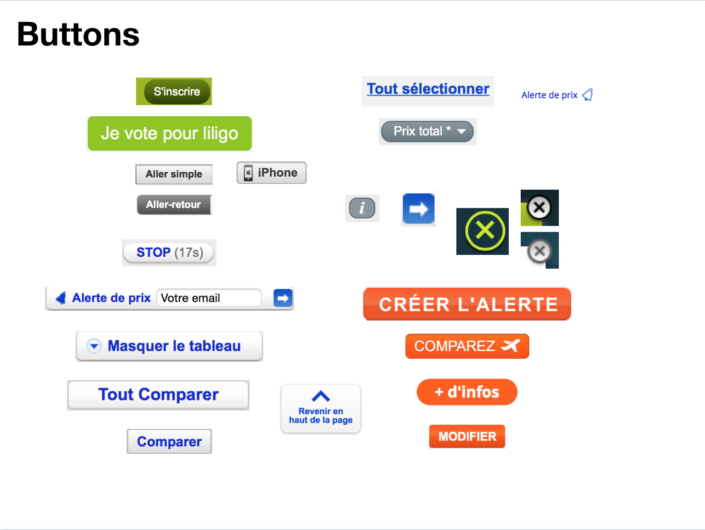

# Diary of my apprenticeship at Craftsmen
## Second period
### 4th week

#### About components and web design

This week, I've learned many things, mainly about design. I was focused on Brad Frost principle of Atomic Design. Atomic design starting point is the fact that we consider web as pages, whereas internet is not a book. This misconception about the web drives designer to conceived experiences that lack consistency. This is why Brad Frost invented the concept of Atomic design. The idea is that each basic element of a web page is like an atom. those elements combine to make molecules, which can combine to make organisms, which may become templates and eventually pages. [This article of his blog](http://bradfrost.com/blog/post/atomic-web-design/) is particularly enlightening.

#### Style guide vs Living Style guide

How to build more consistent web product then? Indeed, many tools exist to help building what we call a Style guide. A style guide is a page that sums up all the styles for each element of a product. [Here](http://styleguides.io) you can find examples of what a style guide actually looks like. One of the most popular tools to help you make your styleguide for instance, is called [Barebones](http://barebones.paulrobertlloyd.com). At Craftsmen however, we prefer to make our own living style guide, which is different as it evolves simultaneously to our product. Therefore, we can compare both the product evolution and the styleguide we generate to keep consistency.

#### The interface inventory ultimate test

To know if your website/app is consistent, there's no better test than the interface inventory, [another concept](http://bradfrost.com/blog/post/interface-inventory/) invented by Brad Frost. The idea is to take any web page or service and to split up all the styles by components. If your product is consistent, you shouldn't find a dozen of styles for button like I found while doing the exercise for liligo website.

Interface inventory also a good tool to start with when you want to rebuild a website.
